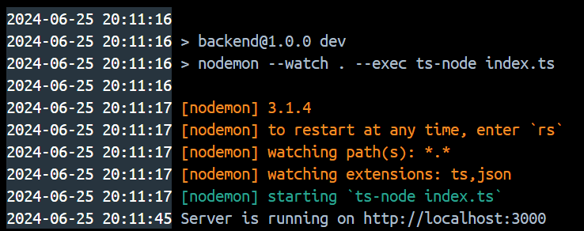
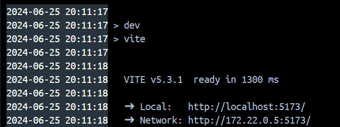
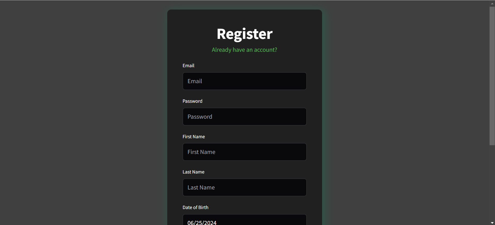
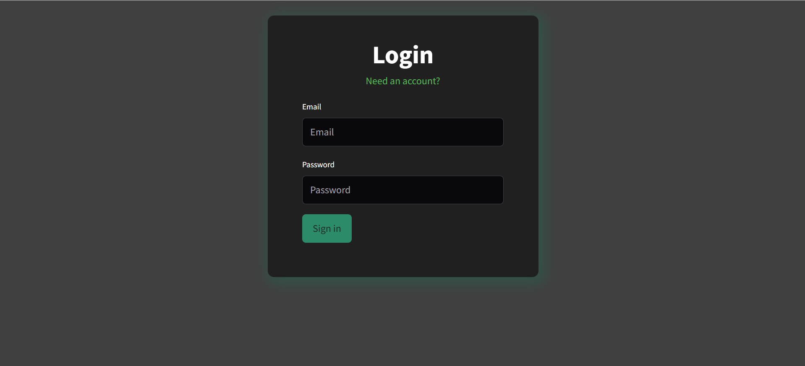
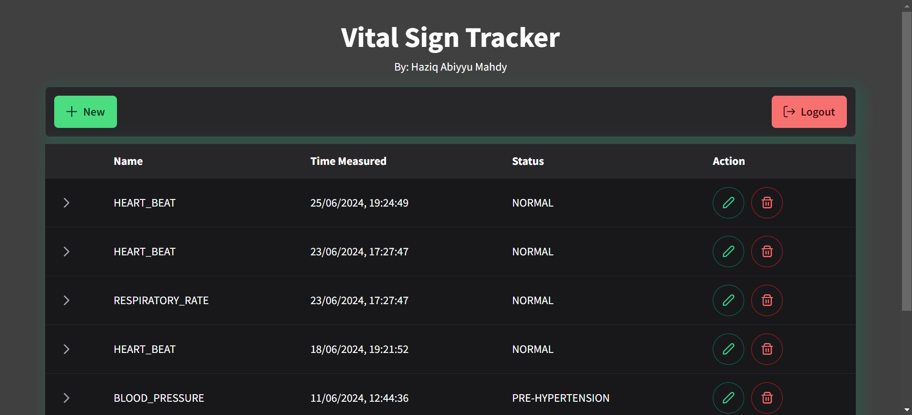
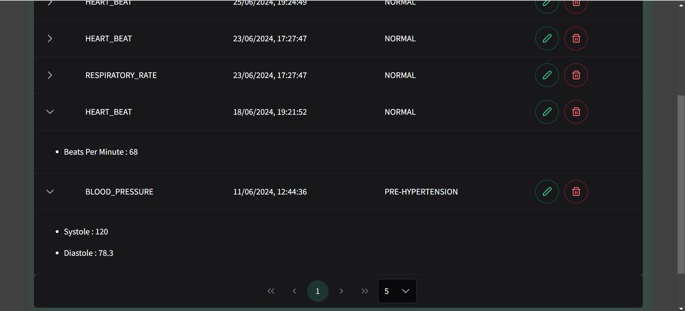
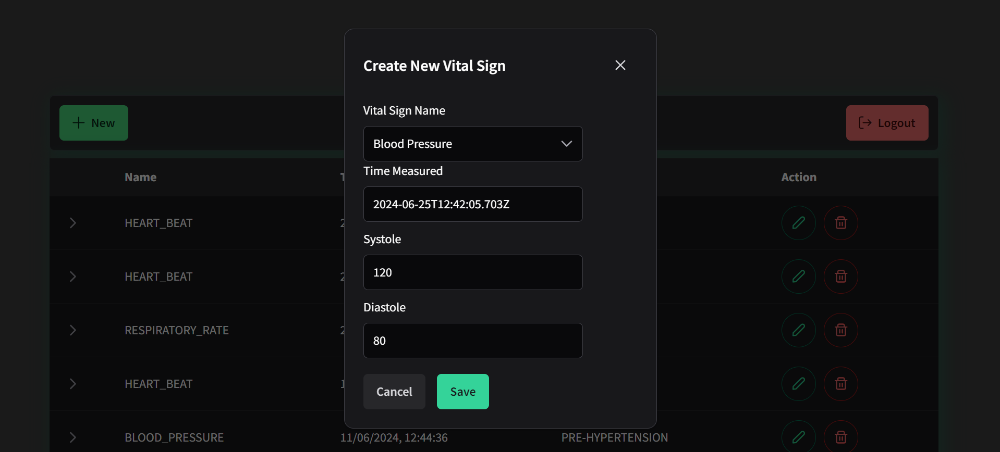

# Web Pencatatan TTV (Tanda-Tanda Vital)

## TTV

Pemeriksaan tanda-tanda vital atau TTV adalah prosedur pemeriksaan yang dilakukan untuk mengetahui tanda vital seseorang. Hal ini bertujuan untuk mendeteksi gangguan, kelainan, atau perubahan pada fungsi organ tubuh.

Pemeriksaan TTV merupakan metode paling dasar yang membantu dokter untuk mendiagnosis penyakit. Selain itu, dokter juga akan lebih mudah merencanakan terapi medis yang tepat untuk pasien.

Reference: https://www.honestdocs.id/tanda-tanda-vital-ttv-pemeriksaan-nilai-normal

## Features

-   Authentication
    -   Register
    -   Login
-   CRUD of Vital Signs
    -   Heart beat
    -   Blood pressure
    -   Respiratory rate
    -   Body temperature

## Technologies Used

-   Express.js
-   MongoDB
-   Redis
-   Docker
-   Vue.js
-   Primevue

## How to use

1. Copy environment variables (adjust if necessary)

    ```
    cp .env.example .env
    ```

2. Run the app using docker

    ### Build the image

    ```
    docker compose build
    ```

    ### Run the container

    ```
    docker compose up
    ```

    ### How to run with hot reload - for development (beware of docker lock file: https://github.com/docker/compose/issues/11069)

    ```
    docker compose watch
    ```

3. Ensure all frontend and backend are working
   
   

4. Access page at http://localhost:5173

5. Make an account (you can use dummy data)

6. Login

7. Play around with the app

## Preview







## Credits

Thank you to [Mutoe](https://github.com/mutoe) for a great Vue 3 starter template. The template can be accessed [here](https://github.com/mutoe/vue3-realworld-example-app)
